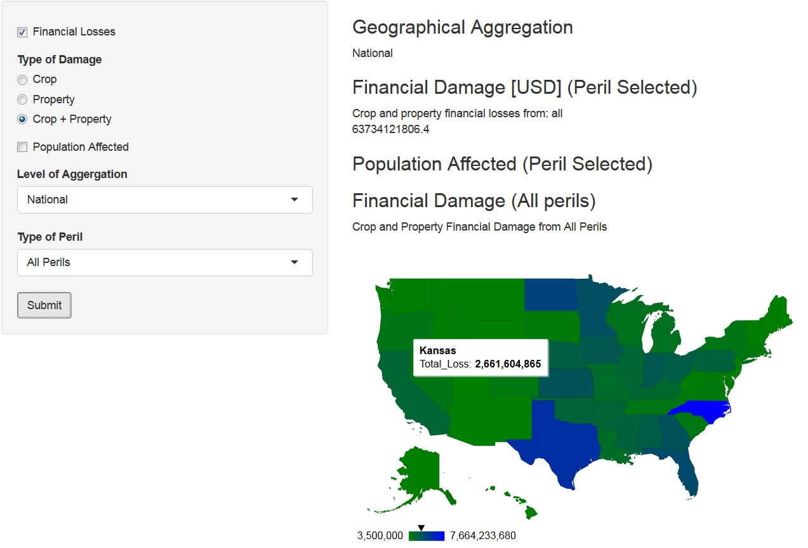
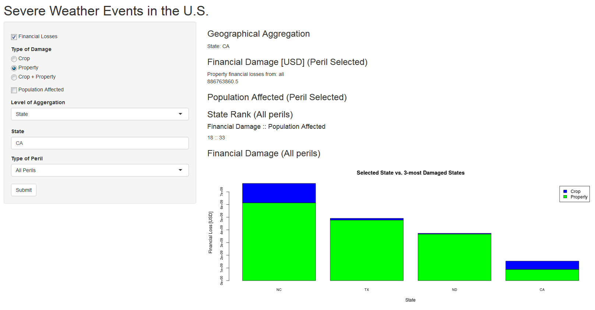

## Description
The application shows damage due to severe weather in the United States 

### Metrics for damage

- property and crop financial loss 
- injured population and fatalities

### Results are shown at two levels of geographical disaggregation:

- national level (maps with losses at each state)
- state level (bar charts with losses compared with the 3-most damaged stated )

### Location
https://acr99.shinyapps.io/US_SevereWeather/

---

## Data

The data used in the application is downloaded from the U.S. National Oceanic and Atmospheric Administration's (NOAA) Storm Database.

Only part of their data is used in the analysis, selected by the five most important perils: **Flood, Hail, Hurricane, Tornado, Storm Surge**


```r
noaa <- read.csv("./StormData_subset.csv")
head(noaa, n = 3L)
```

```
##   STATE__ STATE  EVTYPE FATALITIES INJURIES PROPDMG PROPDMGEXP CROPDMG
## 1       1    AL TORNADO          0       15    25.0          K       0
## 2       1    AL TORNADO          0        0     2.5          K       0
## 3       1    AL TORNADO          0        2    25.0          K       0
##   CROPDMGEXP REFNUM
## 1                 1
## 2                 2
## 3                 3
```

---

## Results
### Features at Country Level

1. Financial losses/Population affected shown by peril  
2. Financial losses/Population affected shown on map for all states  
3. Mouse rendering over a state shows damage in that state  

### Example
<div style='text-align: left;'>
    
</div>

---

## Results
### Features at State Level

1. Financial losses/Population affected shown by peril 
2. Rank of state specified among other states in terms of financial losses of population affected   
3. Financial losses/Population affected  shown on bar-chart and compared with other states  

#Example
<div style='text-align: left;'>
    
</div>
